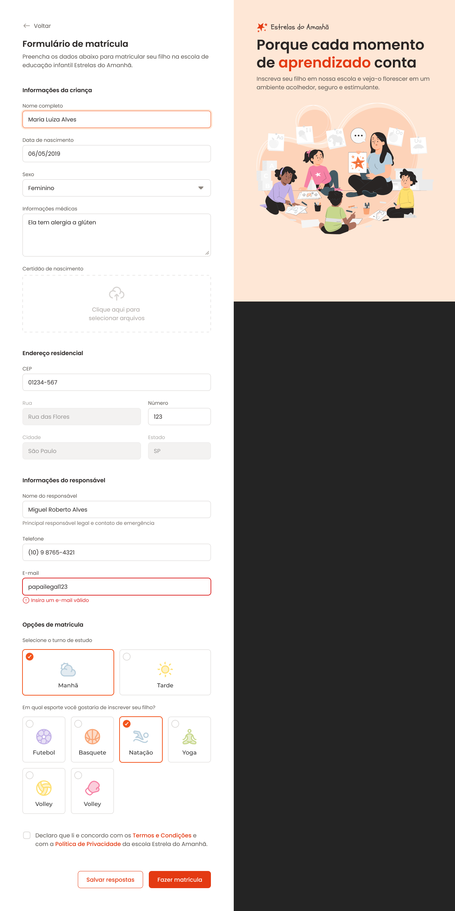

# Formulário de Matrícula

___

Uma página simples e funcional criada para simular o cadastro de alunos em uma escola. O projeto tem como objetivo treinar e explorar o uso de campos de input e formulários em HTML e CSS, com foco em boas práticas de desenvolvimento e acessibilidade.

---

## Sobre o Projeto

O **Formulário de Matrícula** foi projetado para ser um exemplo claro e direto de como implementar formulários interativos e esteticamente agradáveis, com foco em campos de entrada de dados e validações básicas. É uma ótima aplicação para demonstrar habilidades em HTML e CSS.

---

## Funcionalidades

- **Campos de Input Personalizados:**
  - Nome completo.
  - Data de nascimento.
  - E-mail.
  - Telefone.
  - Seleção de curso ou série.
  - Vários outros campos de entrada.
- **Botão de Envio:** Botão estilizado que simula o envio do formulário.
- **Estrutura Semântica:** Organização que facilita a leitura e a acessibilidade do código.
- **Modelo Figma:** Baseado em um protótipo desenhado no Figma e convertido para HTML e CSS com fidelidade.

---

## Tecnologias Utilizadas

- **HTML5:** Estruturação do formulário e aplicação semântica.
- **CSS3:** Estilização, responsividade e aprimoramento visual.
- **Figma:** Utilizado para o design do modelo do formulário.

---

## Demonstração do Projeto

Veja abaixo uma prévia do layout criado no Figma e implementado no código:

---

Feito com :heart: por Tiago Marques.
